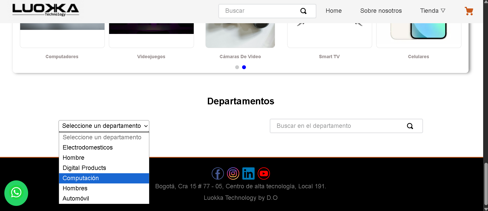

# 🔍 Componente Departament Search

* [🚀 Visión General](#-visión-general)
* [🏗️ Instalación y Ejemplo de Uso](#-instalacion-y-ejemplo-de-uso)
    * [1. Dependencias](#1-dependencias)
    * [2. Declaración en Blocks](#2-declaración-en-blocks)
* [📜 GraphQL Query](#-graphql-query)
* [⚙️ Funcionamiento y Lógica](#-funcionamiento-y-lógica)
* [🎨 Personalización con CSS Handles](#-personalización-con-css-handles)
* [🪪 Contribución y Licencia](#-contribución-y-licencia)


## 🚀 `Visión General`

Este componente fue creado con el template de `react-app-template` y está diseñado para **centralizar la búsqueda de la tienda por departamento**. Al cargar, realiza una consulta GraphQL para obtener todas las categorías de nivel superior (departamentos).

Luego, presenta un menu desplegable (`<select>`) para que el usuario elija un departamento. La selección de un departamento actualiza el `slug` de búsqueda, permitiendo que la barra de búsqueda anidada (`SearchBar` de VTEX) dirija al usuario a una página de resultados limitada a ese departamento específico.


## 🖼️ `Previsualización del Componente`




## 🏗️ `Instalación y Ejemplo de Uso`

El componente se declara como un bloque simple. No requiere propiedades (`props`) externas, ya que obtiene sus datos directamente a través de una consulta GraphQL.

### 1. Dependencias

Asegúrate de tener las siguientes aplicaciones en el `manifest.json` de tu tienda, además de las dependencias de React:

* `vtex.store-components` (Necesaria para usar `SearchBar`).
* `vtex.store-graphql` (Necesaria para ejecutar la consulta GraphQL).
* `vtex.css-handles` (Necesaria para usar CSS Handles).

### 2. Declaración en Blocks

El componente se utiliza como un bloque estándar en cualquier *template* o bloque principal (Ej. `store/blocks.jsonc`):

```json
"departament-search": {
  "title": "Buscador por Departamento",
  "props": {
    // No requiere props, los datos son obtenidos por una consulta de GraphQL
  }
}
```

## 📜 `GraphQL Query`

El componente utiliza el hook `useQuery` de Apollo para obtener las categorías de nivel 1.

> **IMPORTANTE:** El campo `treeLevel: 1` asegura que solo se traigan los departamentos de nivel superior, ideales para ser listados como opciones principales.

```graphql
query {
  categories(treeLevel: 1) {
    id, 
    name,
    slug
  }
}

```

## ⚙️ `Funcionamiento y Lógica`
El componente opera en dos partes principales:

* **`DepartamentSearch.tsx` (Contenedor):**
    * Maneja el estado de carga (`loading`).
    * Mantiene el estado `slug` para construir la URL de búsqueda personalizada.
    * Renderiza el título, el selector (`DepartamentGroup`), y la barra de búsqueda (`SearchBar`).

* **`DepartamentGroup.tsx` (Selector):**
    * Renderiza el selector (`<select>`) con las categorías obtenidas.
    * Al seleccionar una opción, ejecuta la función `onHandleSetSlug`, que actualiza el `slug` del componente padre al formato de búsqueda de VTEX.
    
    ```json
    // Formato de URL de búsqueda generado:
    // /{{slug_del_departamento}}/${term}&map=ft
    handleSetSlug(`${evento.target.value}/$\{term\}&map=ft`); 
    ```

* **`SearchBar`:** Consume el `slug` generado como `customSearchPageUrl`, limitando la búsqueda al departamento seleccionado.

---


## 🎨 `Personalización con CSS Handles`
Puedes personalizar la apariencia de los elementos usando las siguientes clases (CSS Handles):

| Handle | Elemento | Descripción |
| :--- | :---| :--- |
| **`container`** | `<div>` | Contenedor principal que envuelve al DepartamentGroup y al SearchBar.|
| **`loading`** | `<div>` | Contenedor que muestra el mensaje de "Cargando...".|
| **`title`** | `<h2>` | Título "Departamentos". |


## 🪪 `Contribución y Licencia`

### 🤝 Contribución 

Si deseas contribuir con mejoras, reportar *bugs* o sugerir nuevas características:

1.  Haz un *fork* del repositorio.
2.  Crea una nueva rama (`git checkout -b feature/nueva-funcionalidad`).
3.  Realiza tus cambios y haz *commit* (`git commit -m 'feat: Añadir nueva funcionalidad'`).
4.  Sube la rama (`git push origin feature/nueva-funcionalidad`).
5.  Abre un *Pull Request*.

###  📜 Licencia

Este proyecto está bajo la **Licencia MIT**.

> **[](https://opensource.org/licenses/MIT)**

> **[](https://github.com/vtex-apps/whatsapp-button/blob/main/LICENSE)**